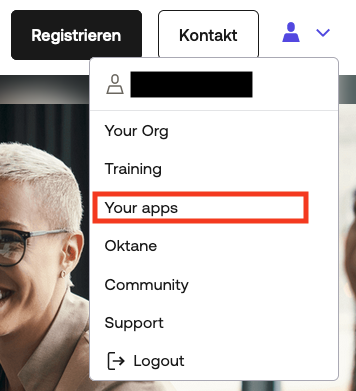
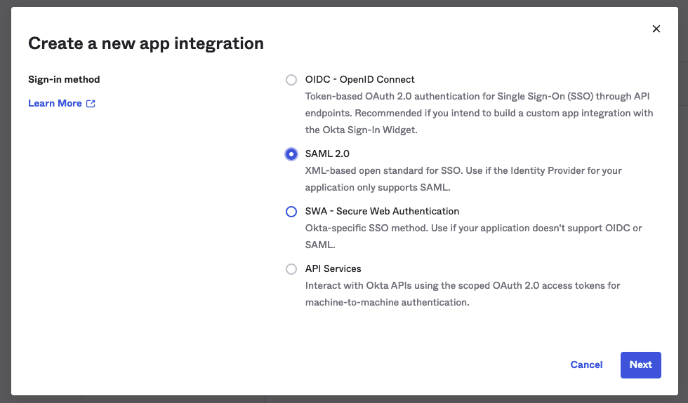
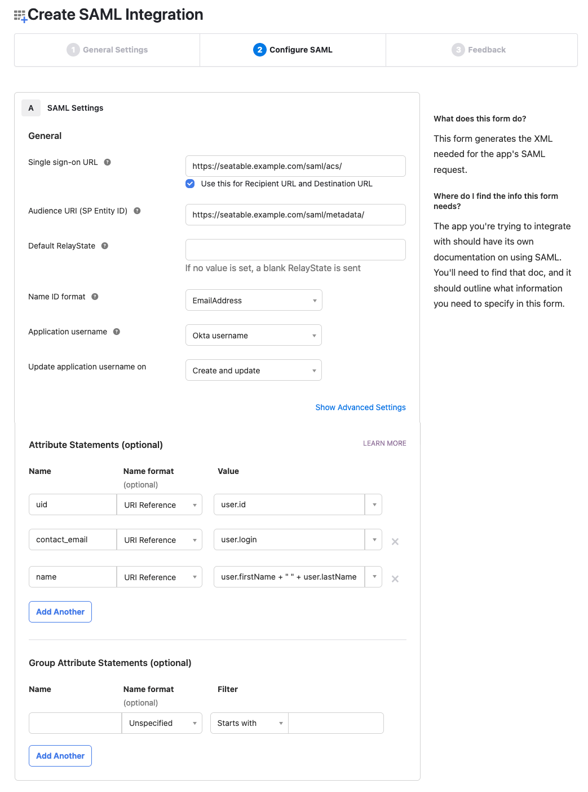
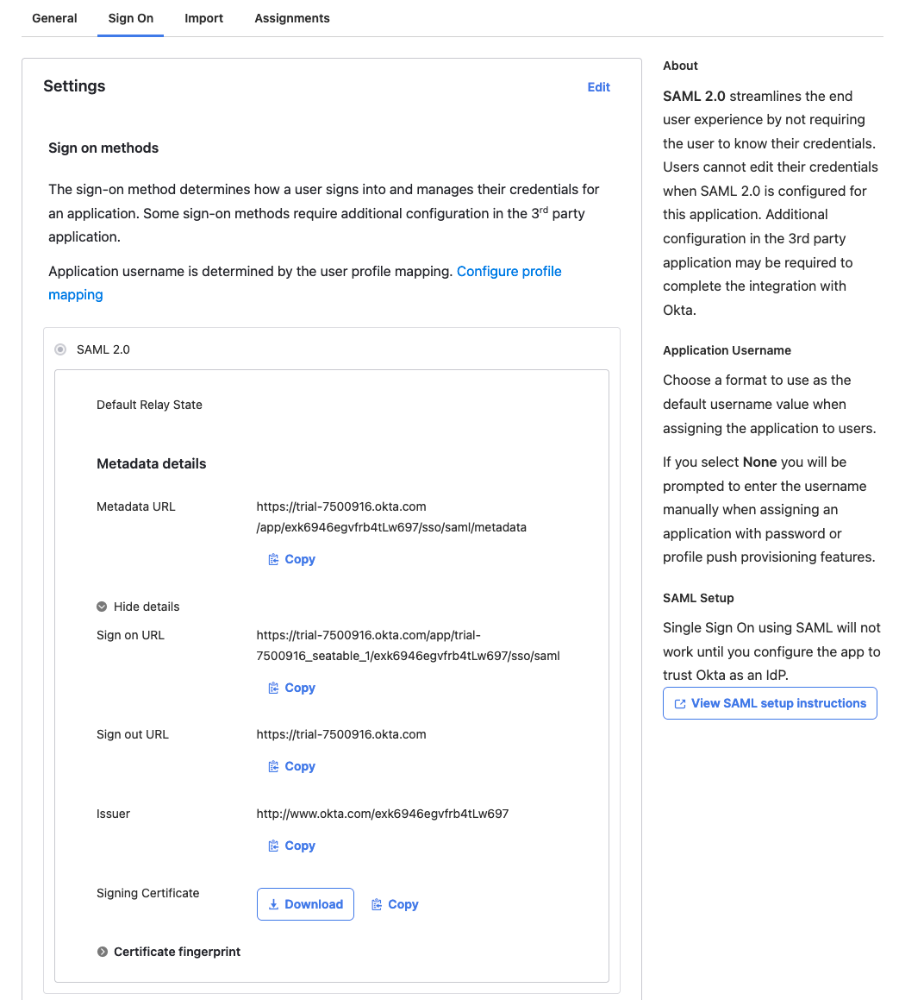
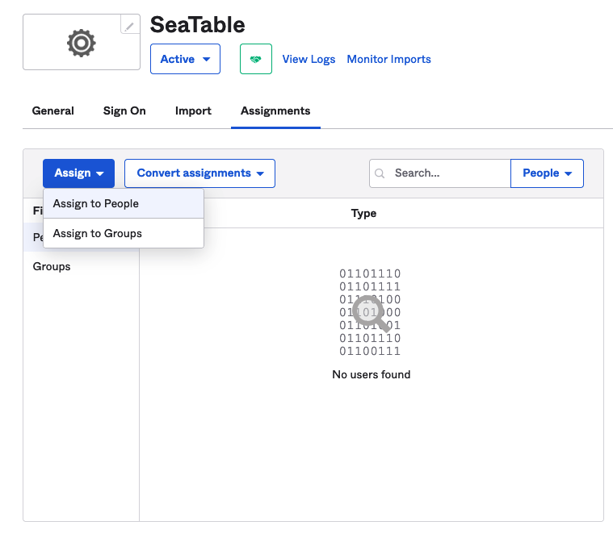
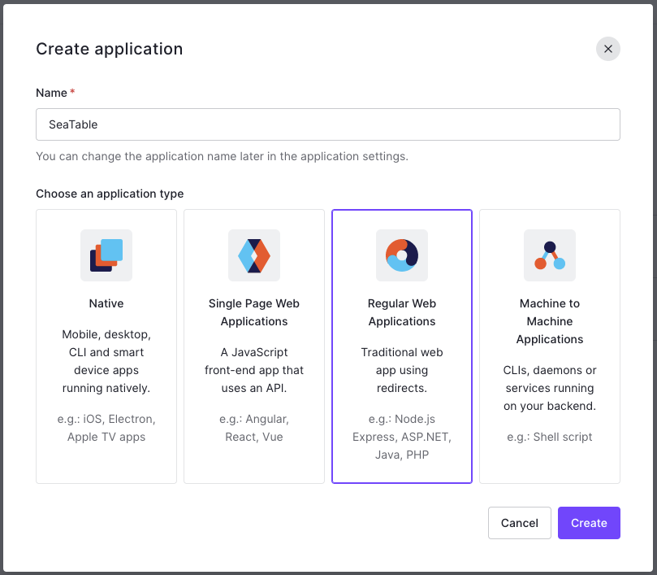
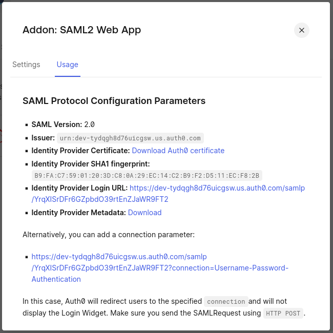
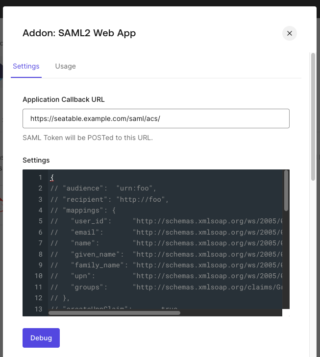

# SAML

Security Assertion Markup Language (SAML) is an open standard for exchanging authentication and authorization data between parties. An important use case of SAML is web-browser single sign-on (SSO).

This document assumes that you have a basic understanding of SAML and that you understand the related terminology.

!!! Recent revision of SAML configuration

        SeaTable's SAML configuration has undergone substantial changes in SeaTable 3.5. It is highly recommended to update to SeaTable 3.5 or younger if you use SAML. The SAML configuration in prior versions is no longer included in this document. You can still find it in Github.

## SSO with SAML in SeaTable

SeaTable supports SSO with SAML. Specifically, SeaTable supports SAML's IdP-init and SP-init authentication flows.

Besides basic authentication and authorization, SeaTable's SAML implementation also allows to have additional attributes be set by the IdP. Specifically, the following five attributes are supported:

| Attribute     | Description                    | Stored in database table                                                               | ... in column |
| ------------- | ------------------------------ | -------------------------------------------------------------------------------------- | ------------- |
| uid           | Unique identifier from the IdP | [dtable_db.social_auth_usersocialauth](./overview.md#table-social_auth_usersocialauth) | uid           |
| contact_email | Email address of the user      | [dtable_db.profile_profile](./overview.md#table-profile_profile)                       | contact_email |
| name          | Name of the user               | [dtable_db.profile_profile](./overview.md#table-profile_profile)                       | nickname      |
| employee_id   | User ID                        | [dtable_db.id_in_org_tuple](./overview.md#table-id_in_org_tuple)                       | id_in_org     |
| user_role     | Name of the role               | ccnet_db.UserRole                                                                      | role          |

SeaTable also supports the side-by-side configuration of SAML and LDAP. For more information, see [LDAP](./ldap.md).

## Configuration

The SAML configuration proceeds in two phases:

1. IdP: You create a new application in your IdP and configure the application. The IdP-side configuration is concluded with the download of the IdP's signing certificate.
2. SeaTable: You upload the certificate and configure SAML in the config file `dtable_web_settings.py`

SeaTable's SAML configuration must be done manually on the command line. SeaTable does not provide a graphic wizard for configuring SAML. SeaTable cannot be configured by uploading the IdP's `metadata.xml`.

Due to the large number of identity and access management (IAM) solutions, this document explains the SeaTable's SAML SSO configuration in general terms in the rest of this section and showcases the procedure using Microsoft Azure AD (Azure) as one example. (Additional IAM solutions may be added in the future.)

### Creating and configuring a new application in the IdP

Add a new application in the IdP and assign at least one user to this application.

The configuration of SSO with SAML for the just created application involves adding SeaTable's SAML URLs as well as specifying the SAML attributes. The following table contains the relevant URLs in generalized form. Replace `<YOUR_SEATABLE_SERVER_HOSTNAME>` with the fully qualified domain name (FQDN) of your SeaTable Server.

| Type                                 | URL                                                      |
| ------------------------------------ | -------------------------------------------------------- |
| Metadata URL                         | `https://<YOUR_SEATABLE_SERVER_HOSTNAME>/saml/metadata/` |
| Assertion consumer service (ACS) URL | `https://<YOUR_SEATABLE_SERVER_HOSTNAME>/saml/acs/`      |
| Service URL                          | `https://<YOUR_SEATABLE_SERVER_HOSTNAME>/`               |

### Downloading the certificate from the IdP

After creating and configuring the application, download the IdP's signing certificate in PEM format. If the certificate cannot be downloaded in PEM format, download the metadata.xml instead and extract the certificate file from there. The content in the \<\<xxx:X509Certificate\>\> tag contains the certificate.

Also note the URL for the IdP's metadata.xml.

### Uploading the IdP's certificate to SeaTable

The IdP's certificate must be saved on the SeaTable Server. The volume of the SeaTable container is the right place. When saved there, the certificate can be used in different SeaTable Docker containers, e.g. when a new container is created during an update.

The default host path for the SeaTable Docker container is `/opt/seatable/seatable-data/` which is mapped to `/shared/` in the container. It is recommended to create a directory here. If you decide to create the directory elsewhere - which you can - you'll need to account for the custom path in the following steps.

```
$ mdkir /opt/seatable/seatable-data/certs/
```

Change into the directory, create a file idp.crt, and open the file with a text editor of your choice (here nano):

```
$ cd /opt/seatable/seatable-data/certs/
$ touch idp.crt
$ nano idp.crt
```

Paste the content of the certificate in the text editor and save the edits.

Note: You can check the validity of the certificate file using openssl:

```
$ openssl x509 -in idp.crt -noout -dates
```

### Creating SeaTable's certificate and key

Create SeaTable's certificate and key using openssl. The two files must be placed in the same directory as the IdP's certificate.

```
$ cd /opt/seatable/seatable-data/certs/
$ openssl req -x509 -nodes -days 3650 -newkey rsa:2048 -keyout sp.key -out sp.crt
```

Once the command has finished, the directory contains three files: `idp.crt`, `sp.crt`, and `sp.key`.

### Modifying the config file in SeaTable

To enable SAML, add the following parameters to `dtable_web_settings.py`, customize the values to your environment, and restart the SeaTable service:

| Parameter                | Description                                                 | Values                                                                                                                                       |
| ------------------------ | ----------------------------------------------------------- | -------------------------------------------------------------------------------------------------------------------------------------------- |
| ENABLE_SAML              | On/off switch for authentication via SAML                   | `True` or `False`                                                                                                                            |
| SAML_PROVIDER_IDENTIFIER | Name for SAML provider used internally by SeaTable          | Alphanumeric string, e.g. "Azure", "Auth0" or "Authentik"                                                                                    |
| SAML_REMOTE_METADATA_URL | URL of metadata.xml used by SAML IdP                        | URL, e.g. 'https://login.microsoftonline.com/xxx/federationmetadata/2007-06/federationmetadata.xml?appid=xxx'                                |
| SAML_ATTRIBUTE_MAP       | Key-value pairs mapping SAML attributes to local attributes | Keys are the SAML attributes from the IdP; some IdPs use attribute like 'http://schemas.xmlsoap.org/ws/2005/05/identity/claims/emailaddress' |
| SAML_CERTS_DIR           | Path to certificates within the Seatable Docker container   | Path, e.g. /opt/seatable/seahub-data/certs                                                                                                   |

This is a sample configuration. Adapt the values to your needs.

```
ENABLE_SAML = True
SAML_PROVIDER_IDENTIFIER = 'MySAMLProvider'
SAML_REMOTE_METADATA_URL = 'https://login.microsoftonline.com/xxx/federationmetadata/2007-06/federationmetadata.xml?appid=xxx'
SAML_ATTRIBUTE_MAP = {
    'http://schemas.xmlsoap.org/ws/2005/05/identity/claims/uid': 'uid',
    'http://schemas.xmlsoap.org/ws/2005/05/identity/claims/emailaddress': 'contact_email',
    'http://schemas.xmlsoap.org/ws/2005/05/identity/claims/name': 'name',
}
SAML_CERTS_DIR = '/opt/seatable/seahub-data/certs'
```

!!! Details about the SAML_ATTRIBUTE_MAP

        The `SAML_ATTRIBUTE_MAP` defines the values provided by the IdP that SeaTable uses to create a user or update the user's profile.
        Key is the uid which is the unique identifier from the identity providers (not the username within SeaTable). The value of the uid should never change over the life cycle of the user. If you choose the email address as uid and the address changes, SeaTable will create a new user the next time the user logs in.

### Testing

A restart of the SeaTable service to activate the configuration settings.

```
# docker exec -it seatable bash
# seatable.sh restart
```

Navigate to the login page of your SeaTable Server and click on "Single Sign-On" and try to log in. If the configuration is correct, you'll be redirected the IdP's login. Enter the credentials of a user that was assigned to the application created above.

Check `dtable_web.log` for troubleshooting info if authentication fails.

## Configuration Azure

Browse to 'Azure Active Directory' and select 'Enterprise Applications'. In the 'Enterprise applications | All Applications' pane, click on 'New application' to open the 'Browse Azure AD Gallery'. Hit 'Create your own application', enter the name of the application in the input field (e.g. SeaTable), and click 'Create'. (For more information on [how to add an enterprise application](https://learn.microsoft.com/en-us/azure/active-directory/manage-apps/add-application-portal) or [how to create and assign a user account to an enterprise application](https://learn.microsoft.com/en-us/azure/active-directory/manage-apps/add-application-portal-assign-users), see Microsoft's Azure product documentation.) Azure will then create the application and open its overview page (see screenshot below).


Select the just created enterprise application. Click on '2. Set up single sign-on' in the overview page and then select SAML as single sign-on method. All SAML-related parameters for the new application are set in the configurator that now opens.

Step 1 - Basic SAML Configuration: Click on 'Edit' in the top right corner and add SeaTable's metadata URL, ACS URL, and service URL as shown in the screenshot below.


Step 2 - Attributes and Claims: Click on 'Edit' in the top corner and define the claims as shown in the screenshot below.


Step 3 - SAML Certificates: Note the App Federation Metadata URL and download the certificate. The certificate in Base 64 is the correct certificate format.


Proceed with the [upload of the certificate file to SeaTable](#uploading-the-idp's-certificate-to-seaTable). The SAML configuration in `dtable_web_settings.py` should look like this:

```
ENABLE_SAML = True
SAML_PROVIDER_IDENTIFIER = 'Azure'
SAML_REMOTE_METADATA_URL = 'https://login.microsoftonline.com/826f1810-ccc9-.../federationmetadata/2007-06/federationmetadata.xml?appid=...'
SAML_ATTRIBUTE_MAP = {
    'uid': 'uid',                       #required
    'mail': 'contact_email',            #required
    'name': 'name',                     #required
    'employeeid': 'employee_id',        #optional
    'jobtitle': 'user_role',            #optional
}
SAML_CERTS_DIR = '/shared/certs/'
```

Replace the value of the `SAML_REMOTE_METADATA_URL` with the URL obtained in step 3 above.

## Configuration Okta

Browse to 'Your apps' and switch to the admin mode.



Click on 'Applications' in the navigation on the left and one more time on 'Applications' in the drop-down menu.

Select 'Create App Integration' and choose 'SAML 2.0' as sign-in method. All SAML-related parameters for the new application are defined in the configurator that now opens.



Step 1 - General Settings: Enter the name of the app in the input field and upload an app logo.


Step 2 - Configure SAML: Add the single sign-on URL, the audience URI as well as the attributes as shown in the screenshot below. Finish the IdP-side configuration by clicking the button of the same name.



Step 3 - Feedback: You can skip this step.

An overview of the configuration including all information for the server-side configuration is displayed once you made it past the 'Feedback'. Note the Metadata URL and download the signing certificate.



Switch to the tab 'Assignments', click the 'Assign' button, and add user to the app via 'Assign to People'



Proceed with the [upload of the certificate file to SeaTable](https://manual.seatable.io/authentication/saml/#uploading-the-idps-certificate-to-seatable). The SAML configuration in `dtable_web_settings.py` should look like this:

```Python
ENABLE_SAML = True
SAML_PROVIDER_IDENTIFIER = 'Okta'
SAML_REMOTE_METADATA_URL = 'https://...'
SAML_ATTRIBUTE_MAP = {
    'uid': 'uid',
    'contact_email': 'contact_email',
    'name': 'name',
}
SAML_CERTS_DIR = '/shared/certs'

```

Replace the value of the `SAML_REMOTE_METADATA_URL` variable with the URL obtained above.

Restart the SeaTable service for the changes to take effect.

## Configuration Auth0

Click on 'Applications' in the navigation on the left. Then choose 'Applications' in the drop-down menu to see a list of the apps that have already been configured in your account.

Step 1 - Create Application: Enter the name of the app in the input field, select 'Regular Web Applications', and click on 'Create'.



Step 2 - Addons: Enable 'SAML2 WEB APP'. You will now see the 'SAML Protocol Parameters'. Copy the link of the 'Identity Provider Certificate' and the 'Identity Provider Metadata' in a temporary document.



Next, switch to the 'Settings' tab. Enter the URL of the [SeaTable's assertion consumer service](#Creating-and-configuring-a-new-application-in-the-IdP) in the 'Application Callback URL' field.



Once you did that, scroll down a bit to finish the process by clicking 'enable'.

Proceed with the [upload of the certificate file to SeaTable](https://manual.seatable.io/authentication/saml/#uploading-the-idps-certificate-to-seatable) that you obtained in step 2. The SAML configuration in `dtable_web_settings.py` should look like this:

```Python
ENABLE_SAML = True
SAML_PROVIDER_IDENTIFIER = 'Auth0'
SAML_REMOTE_METADATA_URL = 'https://...'
SAML_ATTRIBUTE_MAP = {
   'http://schemas.xmlsoap.org/ws/2005/05/identity/claims/nameidentifier': 'uid',
   'http://schemas.xmlsoap.org/ws/2005/05/identity/claims/emailaddress': 'contact_email',
   'http://schemas.xmlsoap.org/ws/2005/05/identity/claims/name': 'name',
}
SAML_CERTS_DIR = '/shared/certs'
```

Replace the value of the SAML_REMOTE_METADATA_URL variable with the URL obtained in step 2.

Restart the SeaTable service for the changes to take effect.
