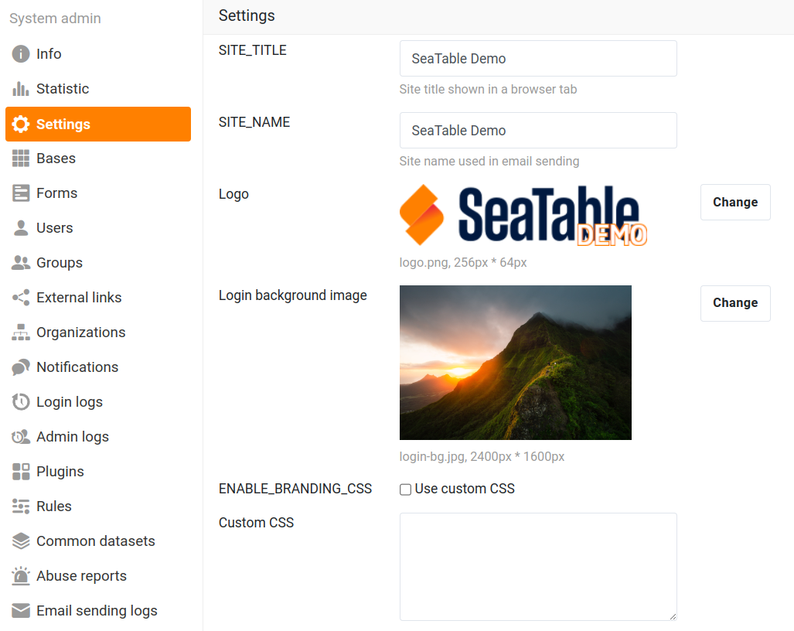
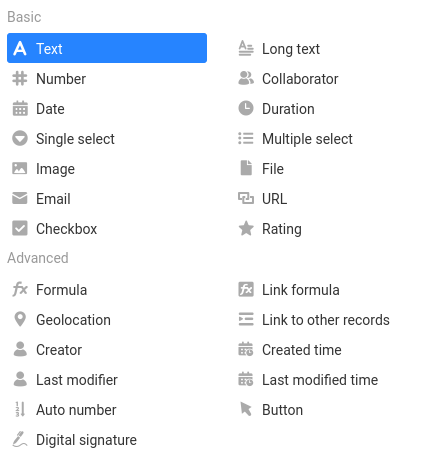
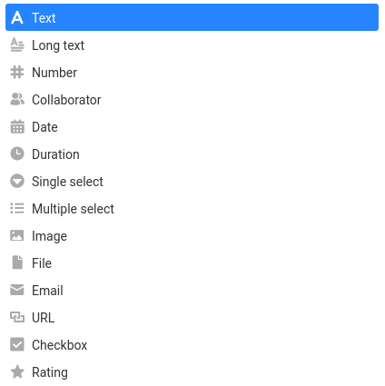

# Custom CSS

SeaTable provides the flexibility to incorporate custom CSS code, allowing users to either conceal specific elements or modify their behavior. This article showcases several examples of what you can achieve with CSS customization.

## How to add custom CSS

Custom css can be added as system admin via the browser of via the command line.
Please refer to the article [main color](../customization/main-color.md) to get an explanation how to add custom css code.



## Examples of custom CSS

### Example: Switching Column Selection to a Single Row

If you've transitioned from using <https://cloud.seatable.io> to a self-hosted system, you may have noticed a difference in how new columns are added. SeaTable Cloud presents the available column types in a single-row list, while your self-hosted server displays them in a two-row box.

**Two-Row Selection in a Self-Hosted Server**



**Single-Row Selection, as in SeaTable Cloud**



To achieve a single-row display like in SeaTable Cloud, add the following CSS styles:

```bash
.select-column-popover .select-column-list .select-column-title {display:none;}
.select-column-popover .select-column-list {display:block !important;}
.select-column-popover .select-column-list .select-column-item {width:100% !important;}
.mobile-editor-column .select-column-container .am-list-header {display:none;}
```
