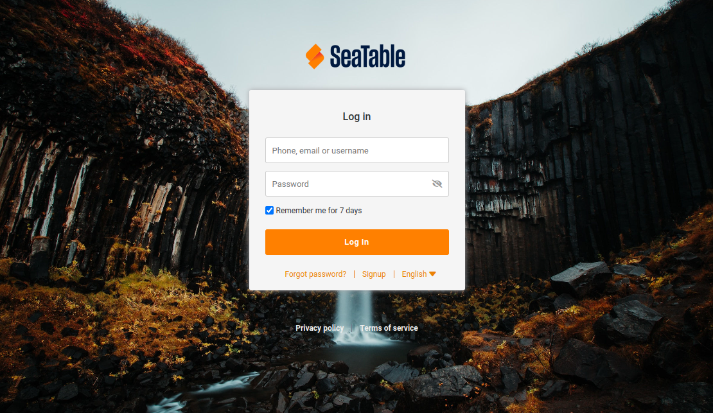
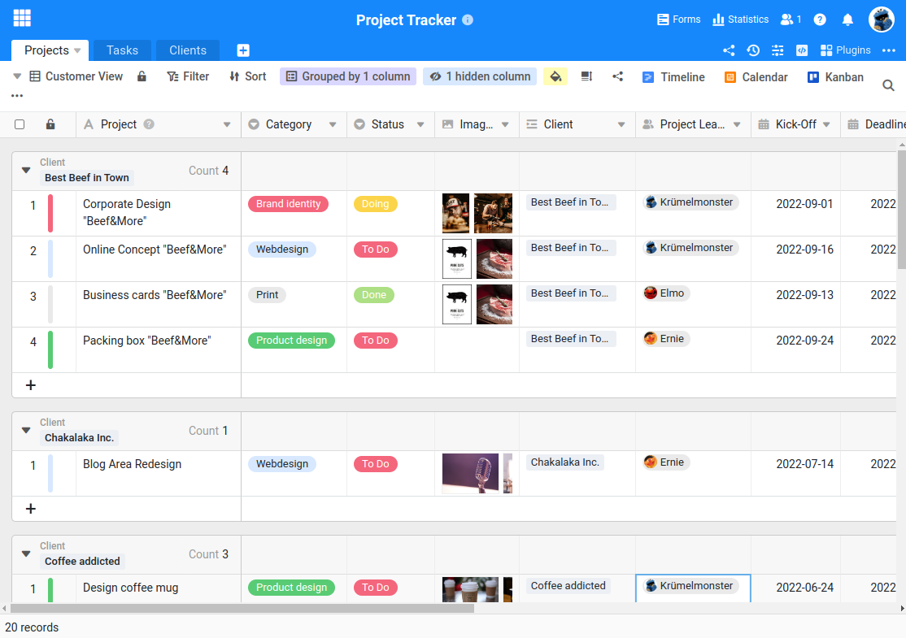

# Welcome to SeaTable

## About SeaTable admin documentation

This admin manual cover the typical topics, from installation to configuration, backup and maintenance of your **own SeaTable Server**.

- For information about how to use SeaTable, please refer to the [user documentation](https://seatable.io/docs/?lang=auto).
- For developer-focus documentation, such as using SeaTable's API, scripting, ... refer either to the [API reference](https://api.setable.io) or have a look at the [developer manual](developers.seatable.io).
- There are additional ressources. Check out our YouTube channel to get a better understanding of how to use SeaTable or to raise questions at the [community forum](https://forum.seatable.io).

## What is SeaTable?

SeaTable is a no-code database and app-building platform. At the first glimpse it looks like an online spreadsheet selection like google sheets, but under the hood it offers so much more. SeaTable helps you to record and manage all kinds of scattered information. Use Filters, Sortings or Group to work corabolative with friends and collegues. Visualize any data with various plugins like Kanban, Gallery or Calendar.

With APIs and SDKs, you can quickly scale to your needs, automate data processing and automate business processes.

Main features includes:

- A spreadsheet like interface to records data supporting collaboratively editing.
- A form app to collect data from outside.
- Mobile ready UI to be used on browsers in mobile system to view and collect data.
- Comprehensive API and SDK for adding extensions.
- Filters, sorts, charts and pivotal tables to visualize and analyze data.

This admin manual will help you to install, configure and update your own SeaTable Server.

## How to use SeaTable?

Due to the fact, that you are reading the administrator manual, you might run your own SeaTable Server. Just keep reading. :sweat_smile:

But just in case that you don't want to take the hurdle to run your own server, SeaTable GmbH offers two other products next to **SeaTable Server**:

??? abstract "SeaTable Cloud: ready in seconds"

    Additionally, there is [SeaTable Cloud](https://cloud.seatable.io), a cloud service for users that do not want to self-host or simply trial SeaTable Server. SeaTable Cloud can be used free-of-charge with the "Free" subscription. More features and higher resource limits are available in [SeaTable Cloud's paid subscriptions](https://seatable.io/preise/?lang=auto).

??? tip "SeaTable Dedicated: Full control without any huzzle"

    Then, there is [SeaTable Dedicated](https://seatable.io/on-premises/). SeaTable Dedicated is a managed and private SeaTable Cloud. We (=SeaTable GmbH) run and manage the Server for you, but it is your system. You define which URL to use, which logo or color code should greet your users.

## Installation

This manual provides two different approaches how to install SeaTable.

### Single-Node Installation

There is a _Single-Node Setup_, where all components of SeaTable are installed on one Server or virtual machine. All services can be reached by one single URL. The installation is fairly straigt forward thanks to the consequent usage of Docker. This setup is easy for testing and production for up to 100 users.

### Advanced Setup

The _advanced setup_ is not an installation type, but the articles in this section provide the necessary information to operate each component separately. The descriptions result in a highly available cluster setup for thousands of users.

## Screenshots

